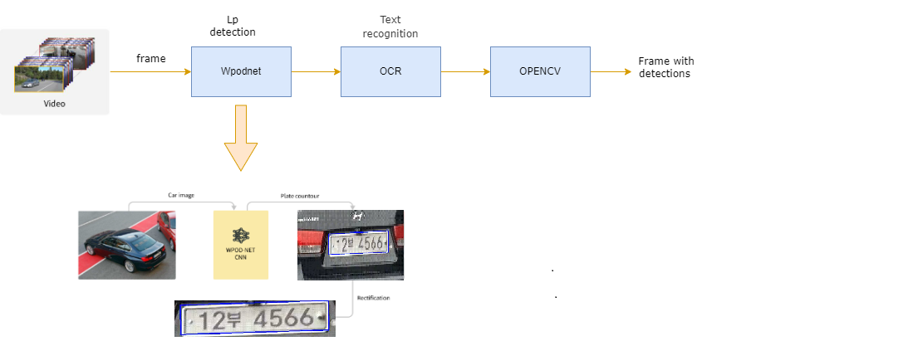

# License plate detection and recognition #

License plate detection and recognition is the process of automatically identifying license plates on vehicles and extracting the alphanumeric characters on them. This technology is used in various applications such as toll collection, parking management, traffic control, and law enforcement.

The process of license plate detection involves using computer vision techniques to detect the location of license plates within an image or video frame. This can be done using techniques such as edge detection, blob detection, and template matching.

Once the license plate is detected, the next step is to recognize the characters on the plate. Optical Character Recognition (OCR) techniques are commonly used for this task. OCR involves analyzing the image of the license plate and using pattern recognition algorithms to identify the individual characters.

There are many challenges to license plate detection and recognition, such as variations in license plate design, lighting conditions, and camera angles. To overcome these challenges, advanced machine learning algorithms such as convolutional neural networks (CNNs) and deep learning techniques are used.

Overall, license plate detection and recognition technology has many applications in the fields of transportation, security, and law enforcement, and it continues to advance with the help of machine learning and computer vision techniques.


## About ##
 Korean  license plate detection and recognition (ALPR) pipeline.Repisotory based PyTorch and Tensorflow frameworks.
 LP detection part used Wpodnet (Tensorflow) technique and Character Recognition (OCR) part is based Pytorch. Both technique is combined by python    
## Method ##


## Dependencies ##
```
$ conda create -n alpr python=3.7  # create environment
$ git clone https://github.com/uraimov92cnu/License-plate-detection-and-recognition.git  # clone
$ cd ALPR 
$ pip install -r requirements.txt  # installing dependencies
```
## Usage ##
```
$ python main.py --video ('input video file name') --output ('output file name and expected format e.x:output.mp4')
```
## Test result_1 ##


## Test result_2 ##


video by author


## Reference ##
1.https://github.com/KavenLee/wpod_ocr

2.https://github.com/sergiomsilva/alpr-unconstrained
# License-plate-detection-and-recognition
